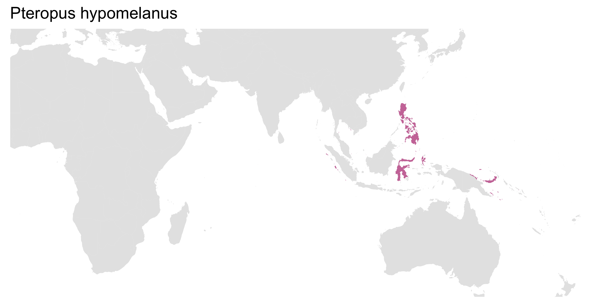
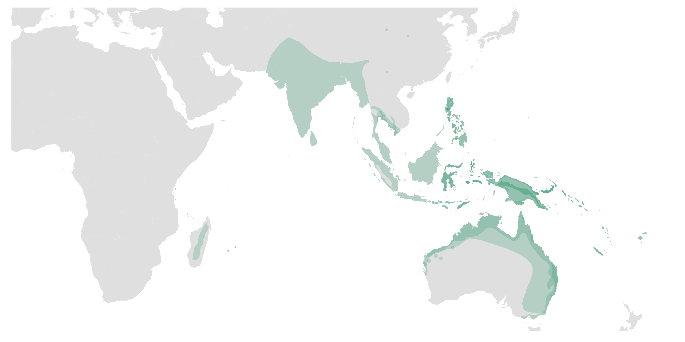
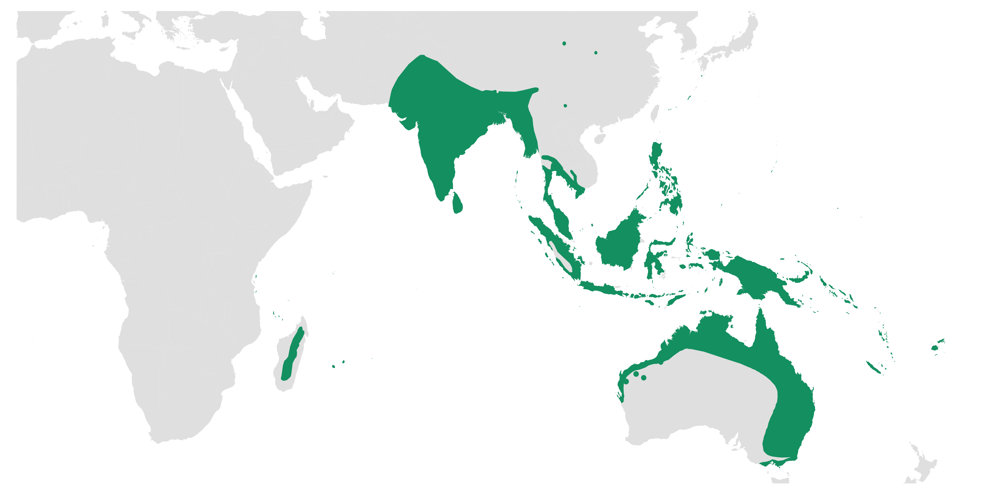
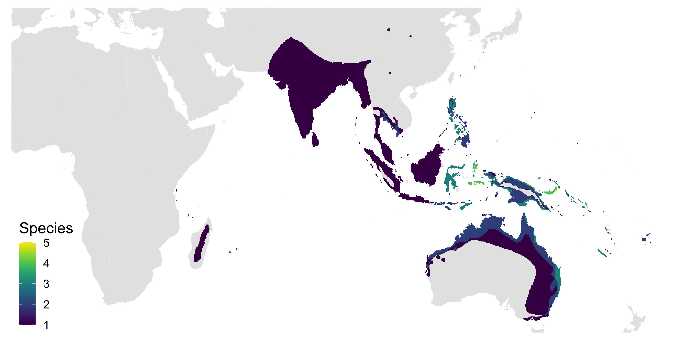

# IUCN_range_overlap
R code for plotting overlapping species geographic ranges from IUCN
Range data for terrestrial mammal species and other groups [here](https://www.iucnredlist.org/resources/spatial-data-download).

## The following examples use the ranges of *Pteropus* fruit bat species.

- Plotting single host ranges

- Plotting overlapping ranges with transparency

- Plotting overlapping ranges without transparency

- And plotting the number of species with overlapping ranges

